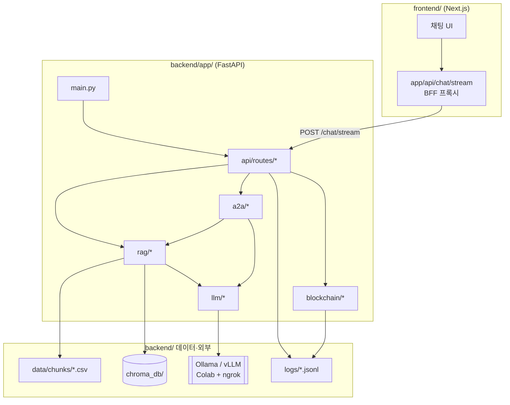

# DoctrineRAG 백엔드 아키텍처 가이드

이 문서는 **프론트엔드 · 백엔드 · RAG · LLM(AI)** 를 처음 구조화하는 분들을 위해, `backend/` 디렉터리가 **무엇을 하고**, **어떻게 서로 연결되는지**를 교과서적으로 정리한 설명입니다.

---

## 1. 한 줄 요약

> **프론트(Next.js)** 가 HTTP로 **백엔드(FastAPI)** 에 질문을내면,  
> **RAG 레이어**가 ChromaDB에서 교리 문단을 찾고,  
> **LLM 레이어**가 Ollama/vLLM으로 답변을 만들며,  
> 필요 시 **A2A 레이어**가 육·해·공 3군을 병렬 조회한 뒤 합성합니다.

---

## 2. 전체 연결 그림



### 레이어 역할 (4층으로 기억하기)

| 층 | 폴더 | 비유 |
|----|------|------|
| **Presentation (API)** | `app/api/` | 식당 **홀** — 주문 받고 음식 나가게 연결 |
| **Domain (RAG·A2A)** | `app/rag/`, `app/a2a/` | **주방 레시피** — 무엇을 찾고 어떻게 조합할지 |
| **Infrastructure (LLM·DB)** | `app/llm/`, `chroma_db/` | **가스레인지·냉장고** — 실제 생성·저장 |
| **Cross-cutting** | `app/core/`, `app/blockchain/` | **매뉴얼·장부** — 설정·감사 |

---

## 3. 요청이 지나가는 두 가지 길

### 3.1 표준 스트림 (`표준` 파이프라인)

프론트 `POST /api/chat/stream` → 백엔드 `POST /chat/stream`

```
사용자 질문
  → api/routes/chat.py          (HTTP·감사 로그 시작)
  → rag/service.py              (라우팅: RAG vs 일반)
      ├─ rag/query_router.py    (auto 모드일 때 판별)
      ├─ rag/embeddings.py      (질문 벡터화)
      ├─ rag/vector_store.py    (Chroma 유사도 검색)
      └─ llm/bridge.py          (프롬프트 + LLM 호출)
  → NDJSON 스트림 (meta → delta* → done) 으로 프론트에 전달
```

- **한 군(branch)** 만 선택된 상태에서 주로 사용합니다.
- `mode=auto` 이면 교리 키워드·검색 거리로 `rag` / `general` 을 자동 선택합니다.

### 3.2 A2A 합동 (`A2A` 파이프라인)

프론트 → 백엔드 `POST /a2a/task`

```
사용자 질문
  → api/routes/a2a.py
  → a2a/supervisor.py           (LangGraph: 분기·병렬·종합)
      ├─ 키워드로 육/해/공 대상 결정
      ├─ a2a/agents.py          (군별 에이전트 → rag/service.ask_question)
      └─ llm/bridge.py          (3군 비교 요약·종합 문장)
  → Markdown (## 육군 / ## 해군 / ## 공군 + 합동 비교) 한 번에 반환
```

- 프론트는 **스트리밍이 아니라** 응답 전체를 한 번에 받습니다.
- `agent_cards.json` 으로 에이전트 메타데이터를 제공합니다 (`GET /a2a/agents`).

---

## 4. 디렉터리별 상세 설명

### 4.1 `backend/` 루트 (앱 바깥)

| 경로 | 역할 |
|------|------|
| `data/chunks/{army,navy,air_force}/*.csv` | **RAG의 원천 데이터**. PDF에서 잘라 둔 교리 청크(행 단위). 서버가 켜질 때 Chroma에 적재합니다. |
| `chroma_db/` | **벡터 DB 파일**. 질문과 비슷한 문단을 빠르게 찾는 인덱스. |
| `logs/` | 감사 로그(`audit_log.jsonl`), 블록체인 스타일 원장(`local_ledger.jsonl`). |
| `scripts/` | 서버 없이 돌리는 **유지보수 CLI** (재인제스트 등). |
| `main.py` | **호환용 진입점**. `from app.main import app` 만 re-export. 새 코드는 `app.main:app` 사용. |
| `Dockerfile` | 컨테이너 이미지·`uvicorn app.main:app` 실행 정의. |

---

### 4.2 `app/` — 애플리케이션 패키지 전체

Python 패키지 이름이 `app` 입니다. Docker `WORKDIR`가 `/app`이어도, 패키지는 `backend/app/` 폴더입니다.

---

#### `app/main.py` — FastAPI 진입

| 항목 | 설명 |
|------|------|
| **역할** | `create_app()` 으로 FastAPI 인스턴스 생성, CORS, 라우터 등록 |
| **lifespan** | 서버 기동 시 백그라운드에서 `rag/service.run_startup_ingest()` 실행 (CSV → Chroma) |
| **실행** | `uvicorn app.main:app --reload` |
| **연결** | `api/routes` 의 모든 라우터를 `include_router` |

---

#### `app/state.py` — 프로세스 공유 상태

| 항목 | 설명 |
|------|------|
| **역할** | `INGEST_IN_PROGRESS` 같은 **전역 플래그** (기동 중 인제스트 여부) |
| **왜 분리?** | `main.py`와 `health` 라우트가 같은 값을 읽기 위해, 순환 import를 피합니다. |
| **연결** | `GET /health` 응답의 `ingest_in_progress` 필드 |

---

#### `app/core/config.py` — 설정의 단일 출처

| 항목 | 설명 |
|------|------|
| **역할** | `.env` 로드, Chroma 경로, Ollama URL, 군별 컬렉션 이름, TOP_K, CORS 등 |
| **BACKEND_ROOT** | `backend/` 폴더 절대 경로 (`data/`, `chroma_db/`, `logs/` 해석 기준) |
| **PROMPTS_DIR** | `app/rag/prompts/` — 군별 시스템 프롬프트 텍스트 |
| **연결** | 거의 모든 모듈이 `from app.core import config` 로 참조 |

> **실무 팁:** 하드코딩 대신 여기만 보면 “이 서버가 어디를 바라보는지” 한 번에 파악할 수 있습니다.

---

### 4.3 `app/api/` — HTTP 경계 (Presentation Layer)

프론트와 맞닿는 **얇은 층**입니다. 비즈니스 로직은 최대한 `rag/`, `a2a/`에 둡니다.

#### `api/schemas.py`

- Pydantic 모델: `ChatRequest`, `ChatResponse`, `RetrieveRequest`, `A2ATaskRequest` 등
- 요청/응답 **형식 검증** (필드 길이, `top_k` 상한)

#### `api/deps.py`

- 채팅 감사용 헬퍼: `audit_actor_chat`, `emit_standard_chat_ledger_entry`
- 라우트 파일이 비대해지지 않게 공통 로직 분리

#### `api/routes/` — URL ↔ 핸들러

| 파일 | 주요 엔드포인트 | 호출 대상 |
|------|----------------|-----------|
| `health.py` | `GET /health`, `GET /branches` | `vector_store`, `llm`, `blockchain` 상태 |
| `chat.py` | `POST /chat`, `POST /chat/stream` | `rag/service` |
| `documents.py` | `POST /retrieve`, `GET /source-documents` | `rag/service` (LLM 없이 검색만) |
| `llm_routes.py` | `GET /llm/health`, `POST /llm/test` | `llm/factory`, 원격 LLM 연결 테스트 |
| `a2a.py` | `/a2a/*` | `a2a/supervisor`, `a2a/cache`, `blockchain` |
| `admin.py` | `DELETE /reset` | Chroma 전체 삭제 후 재인제스트 |

`routes/__init__.py` 의 `api_router` 가 위 라우터를 한데 묶고, `main.py` 가 등록합니다.

---

### 4.4 `app/rag/` — RAG 핵심 (Retrieval-Augmented Generation)

**“교리 문서에서 관련 문단을 찾아 LLM에게 근거로 넘긴다”** 는 파이프라인 전체입니다.

| 파일 | 역할 | 연결 |
|------|------|------|
| `chunk_loader.py` | CSV 행 읽기, 본문 컬럼(`embedding_text` 등) 선택, 메타데이터 정규화 | `data/chunks/` |
| `embeddings.py` | SentenceTransformer(BGE-M3)로 텍스트 → 벡터 | 인제스트·검색 시 |
| `vector_store.py` | Chroma 컬렉션 CRUD, 유사도 검색 | `chroma_db/` |
| `ingest.py` | 기동 시 **idempotent 인제스트** (이미 있으면 스킵) | `ingest_seed` CLI와 동일 로직 |
| `query_router.py` | `auto` 모드: 일반 잡담 vs 교리 RAG 판별 | `service.ask_question` |
| `service.py` | **오케스트레이션**: 검색 → 필터 → 프롬프트 → LLM → 출처 포맷 | `llm/`, `api/routes/chat.py` |
| `prompts/*.txt` | 군별 교리 답변 톤·형식 (육/해/공) | `llm/prompts.py` 가 로드 |

#### RAG 한 사이클 (교과서 정의)

1. **Retrieval** — 질문을 벡터로 바꾸고 Chroma에서 `top_k`개 청크 검색  
2. **Augmentation** — 검색 결과를 프롬프트 context로 붙임 (`build_rag_user_prompt`)  
3. **Generation** — LLM이 context만 근거로 Markdown 답변 생성  

`service.py` 가 이 세 단계를 코드로 묶습니다.

---

### 4.5 `app/llm/` — LLM 인프라 (AI 생성)

| 파일/폴더 | 역할 |
|-----------|------|
| `factory.py` | `LLM_PROVIDER`(ollama/vllm)에 따라 클라이언트 선택, 군별 모델명 |
| `ollama_client.py` | Colab ngrok 등 **원격 Ollama** HTTP (`/api/chat`, stream) |
| `vllm_client.py` | OpenAI 호환 vLLM 서버 |
| `base.py` | 클라이언트 공통 인터페이스 |
| `prompts.py` | 시스템 프롬프트 조립, RAG user 프롬프트, 합동 종합 프롬프트 |
| `output_guard.py` | 답변 후처리: 섹션 정규화, 3군 비교 요약 압축, 퇴화 방지 |
| `bridge.py` | **고수준 API**: `generate_rag_answer`, `iter_stream_rag_answer`, 합성 등 |
| `_utils.py` | ngrok 헤더, async↔sync 브릿지, 한글/반복 검사 |

**연결:** `rag/service.py` 와 `a2a/supervisor.py` 는 직접 HTTP를 치지 않고 **`llm/bridge.py`** 만 호출합니다.  
→ LLM 벤더를 바꿀 때 `llm/` 만 수정하면 됩니다 (실무에서의 **어댑터 패턴**).

---

### 4.6 `app/a2a/` — Agent-to-Agent 합동

| 파일 | 역할 |
|------|------|
| `supervisor.py` | LangGraph `StateGraph`: 질문 분석 → 군 선택 → 병렬 질의 → Markdown 합성 |
| `agents.py` | `army_agent`, `navy_agent`, `air_agent` — 각각 `rag/service.ask_question` 호출 |
| `audit.py` | A2A·표준 채팅 이벤트를 `logs/audit_log.jsonl` 에 append |
| `cache.py` | 시연용 응답 캐시 (`demo_cache.json`, `A2A_CACHE_ENABLED`) |
| `agent_cards.json` | 에이전트 discovery 메타 (이름, 설명, capability) |

**프론트와의 차이:** 표준 채팅은 **한 branch** + **스트림**; A2A는 **다군 병렬** + **단일 JSON 응답**.

---

### 4.7 `app/blockchain/` — 감사·무결성 (선택 기능)

| 파일 | 역할 |
|------|------|
| `config.py` | `A2A_BLOCKCHAIN_ENABLED`, 원장 파일 경로 |
| `hash_utils.py` | SHA-256 체인용 해시 |
| `audit_event.py` | 채팅/A2A 이벤트 payload (본문 전체가 아닌 해시·메타) |
| `local_ledger.py` | `local_ledger.jsonl` append-only 원장 |
| `verifier.py` | 체인 검증 API (`/a2a/ledger/verify`) |

**연결:** `api/deps.py`, `a2a/supervisor.py` 가 이벤트 발생 시 `emit_blockchain_event` 호출.

---

### 4.8 `scripts/` — 운영·개발 CLI

| 스크립트 | 용도 |
|----------|------|
| `ingest_seed.py` | `python -m scripts.ingest_seed` — CSV → Chroma 수동 적재 |
| `rebuild_chroma.py` | `python -m scripts.rebuild_chroma` — DB 초기화 후 전량 재인제스트 |

서버를 띄우지 않고 **데이터만 갱신**할 때 사용합니다.

---

## 5. 프론트엔드와의 연결

| 프론트 | 백엔드 | 설명 |
|--------|--------|------|
| `frontend/app/api/chat/stream/route.ts` | `POST /chat/stream` | Next.js **BFF**: 브라우저 → Next API → FastAPI (내부 URL) |
| `frontend/app/chat/page.tsx` | 위 프록시 호출 | NDJSON 줄 단위 파싱, UI에 스트리밍 표시 |
| `frontend/lib/env.ts` | `BACKEND_INTERNAL_URL` | Docker 안에서는 `http://backend:8000` |
| A2A 모드 | `POST /a2a/task` | 스트림 없이 전체 Markdown 수신 |

프론트는 **군(branch)·모드(mode)·파이프라인(standard/a2a)** 을 body에 실어 보냅니다.  
백엔드 `api/schemas.ChatRequest` 가 이를 받습니다.

---

## 6. 데이터가 흐르는 시점

| 시점 | 일어나는 일 | 관련 코드 |
|------|-------------|-----------|
| **서버 기동** | CSV가 비어 있으면 Chroma 인제스트 | `main.lifespan` → `rag/ingest` |
| **질문 1건 (RAG)** | embed → search → prompt → LLM | `rag/service` + `llm/bridge` |
| **질문 1건 (A2A)** | 3군 병렬 RAG → 종합 LLM | `a2a/supervisor` |
| **응답 후** | 감사 로그·(옵션) 원장 기록 | `a2a/audit`, `blockchain` |

---

## 7. 의존 방향 규칙 (실무 convention)

```
api/routes  →  rag, a2a, llm, blockchain, core
rag         →  llm, core  (rag는 llm을 모름: bridge만 앎)
a2a         →  rag, llm, core
llm         →  core
blockchain  →  core
scripts     →  rag, core
```

- **안쪽 레이어가 바깥을 import 하지 않음** (예: `llm` 이 `api` 를 import 하면 안 됨).
- **설정은 항상 `core/config` 한곳**.

---

## 8. 새 기능을 넣을 때 어디에?

| 하고 싶은 일 | 넣을 위치 |
|--------------|-----------|
| 새 REST API | `api/routes/xxx.py` + `routes/__init__.py` 등록 |
| 검색·인제스트 로직 변경 | `rag/service.py` 또는 `vector_store.py` |
| 프롬프트·답변 형식 변경 | `llm/prompts.py`, `llm/output_guard.py` |
| Ollama 외 다른 LLM | `llm/factory.py` + 새 client |
| 3군 합동 플로우 변경 | `a2a/supervisor.py` |
| 환경 변수 추가 | `core/config.py` + `.env.example` |

---

## 9. 관련 문서

- [PROJECT_ARCHITECTURE.md](./PROJECT_ARCHITECTURE.md) — frontend / backend / model 전체 구조
- [README.md](../README.md) — 설치, Docker, Ollama/ngrok
- [LOCAL_DOCKER_COMMANDS.md](./LOCAL_DOCKER_COMMANDS.md) — 로컬 Docker 명령

---

## 10. 용어 정리

| 용어 | 이 프로젝트에서의 의미 |
|------|------------------------|
| **Branch** | army / navy / air_force (육·해·공) |
| **Chunk** | CSV 한 행 = 교리 문서의 잘린 한 덩어리 |
| **Collection** | Chroma 안 군별 인덱스 (`army_doctrine` 등) |
| **RAG** | 검색된 청크 + LLM 생성 |
| **A2A** | 여러 “에이전트”(군)가 협업하는 합동 응답 |
| **NDJSON** | 한 줄에 JSON 하나 — 스트리밍 프로토콜 |

---

*문서 버전: backend `app/` 패키지 구조 기준 (2026)*
