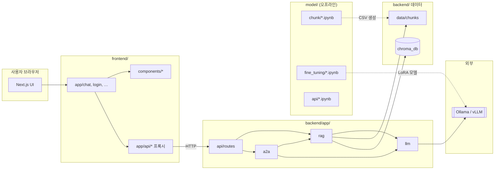
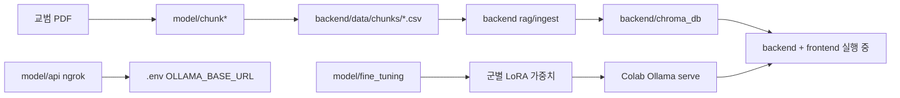

# DoctrineRAG 전체 프로젝트 구조 가이드

`doctrine-rag-ollama` 저장소는 **프론트엔드(Next.js) · 백엔드(FastAPI) · 모델/데이터 파이프라인(model/)** 세 축으로 나뉩니다.  
이 문서는 각 최상위 디렉터리와 **하위 폴더가 무엇을 하고, 어떻게 연결되는지**를 교육용으로 정리합니다.

> 백엔드 `app/` 패키지만 더 깊게 보려면 [BACKEND_ARCHITECTURE.md](./BACKEND_ARCHITECTURE.md) 를 함께 읽으세요.

---

## 1. 저장소 한눈에 보기

```text
doctrine-rag-ollama/
├── frontend/          # 사용자 UI (Next.js 14)
├── backend/         # API · RAG · LLM · A2A (FastAPI)
├── model/           # 연구·전처리·파인튜닝 (Jupyter, 런타임과 분리)
├── docs/            # 아키텍처·운영 문서
├── deploy/          # AWS 배포 (CloudFormation, CI)
├── notebooks/       # (선택) Colab 부팅 등 루트 노트북
├── docker-compose.yml
├── docker-compose.local.yml
├── package.json     # 루트: frontend dev 스크립트 래퍼
├── .env.example
└── README.md
```

### 시스템이 하는 일

| 구분 | 역할 |
|------|------|
| **frontend** | 합참/육·해·공 테마 UI, 채팅·교범 검색·출처·로그 화면 |
| **backend** | CSV 청크 → Chroma 검색 → Ollama/vLLM 답변, A2A 3군 합동 |
| **model** | PDF 청킹, Chroma 적재 실험, LoRA 파인튜닝, Colab Ollama/ngrok (개발 단계) |

**런타임에 필수:** `frontend/` + `backend/` + `backend/data/chunks/` + `backend/chroma_db/` + `.env`  
**런타임에 불필요:** `model/` (결과물만 CSV/Chroma로 backend에 반영되면 됨)

---

## 2. 전체 연결 그림



---

## 3. `frontend/` — 프레젠테이션 계층

Next.js **App Router** 기반. 브라우저는 주로 **같은 출처의 `/api/*`** 를 호출하고, Next 서버가 **백엔드 FastAPI** 로 프록시합니다 (BFF 패턴).

### 3.1 디렉터리 트리 (요약)

```text
frontend/
├── app/                    # 라우팅·페이지·API Route (BFF)
│   ├── layout.tsx          # 전역 HTML, styled-components 레지스트리
│   ├── page.tsx            # 진입 → HomeGate
│   ├── HomeGate.tsx        # 로그인 여부에 따라 /chat 또는 /login
│   ├── login/page.tsx
│   ├── chat/
│   │   ├── layout.tsx
│   │   └── page.tsx        # ★ 메인 채팅 (상태·스트림·A2A)
│   ├── admin/page.tsx
│   └── api/                # ★ 백엔드 프록시 (서버 전용)
│       ├── health/
│       ├── chat/ + chat/stream/
│       ├── search/
│       ├── source-documents/
│       ├── conversations/
│       ├── sources/[docId]/
│       └── a2a/           # task, agents, cache, ledger, audit
├── components/             # Atomic Design
│   ├── atoms/              # Avatar, Icon, MarkdownContent
│   ├── molecules/          # ChatMessageBlock, PromptComposer, …
│   ├── organisms/          # ChatWorkspace, AppHeader, Sidebar, …
│   ├── templates/          # DoctrineRagTemplate (3단 레이아웃)
│   └── auth/               # RequireAuth
├── lib/                    # 순수 TS 유틸·타입·파싱
├── public/                 # 정적 파일 (header-emblem.png)
├── scripts/                # clean-next.js 등
├── package.json
├── next.config.js
└── Dockerfile
```

### 3.2 `app/` — 페이지와 BFF

| 경로 | 역할 | 백엔드 연결 |
|------|------|-------------|
| `chat/page.tsx` | 채팅 상태 관리, 표준 스트림 NDJSON 파싱, A2A POST | `/chat/stream`, `/a2a/task` |
| `login/page.tsx` | 로컬 세션 로그인 UI | (주로 프론트 `lib/auth`) |
| `api/chat/stream/route.ts` | 스트림 프록시, `maxDuration` 300s | `POST backend/chat/stream` |
| `api/health/route.ts` | 헬스체크 프록시 | `GET backend/health` |
| `api/a2a/task/route.ts` | A2A 합동 프록시 | `POST backend/a2a/task` |
| `api/search/route.ts` | 교범 검색 | `POST backend/retrieve` |

**왜 BFF?** 브라우저에 `BACKEND_INTERNAL_URL`(Docker: `http://backend:8000`)을 노출하지 않고, CORS·타임아웃·헤더를 Next에서 통제합니다.

### 3.3 `components/` — UI 조립 (Atomic Design)

| 레벨 | 예시 | 역할 |
|------|------|------|
| **atoms** | `MarkdownContent`, `AvatarCircle` | 최소 UI 단위, Markdown 렌더 |
| **molecules** | `ChatMessageBlock`, `JointSummaryPanel`, `BranchDoctrinePanel` | 메시지 1건, 3군 카드, 입력창 |
| **organisms** | `ChatWorkspace`, `AppHeader`, `SidebarPanel` | 채팅 영역 전체, 헤더·군 탭, 사이드바 |
| **templates** | `DoctrineRagTemplate` | 좌(사이드바) · 중(본문) · 우(참고문헌) 그리드 + 군별 테마 CSS 변수 |

**데이터 흐름 (채팅 UI):**

```
chat/page.tsx
  → DoctrineRagTemplate (branch 테마, 탭)
      → ChatWorkspace
          → ChatMessageBlock (assistant: 3군 split / 단일 답변)
              → BranchDoctrinePanel / DoctrineAnswerPanel
                  → MarkdownContent
```

### 3.4 `lib/` — 프론트 전용 로직

| 파일 | 역할 |
|------|------|
| `types.ts` | `ChatMessage`, `BranchId`, `HealthPayload` 등 |
| `env.ts` | `BACKEND_INTERNAL_URL`, `TOP_K_MAX` |
| `auth.ts` | 로그인 사용자·권한 (ADMIN → 로그 탭) |
| `parseDoctrineSections.ts` | `##` 헤더 기준 섹션 파싱 (개요, 핵심 원칙…) |
| `markdownSections.ts` | Markdown 정규화 (유의사항 불릿, 근거 제거) |
| `jointSummary.ts` | 3군 비교 요약 1줄 파싱 |
| `branchUiTheme.ts` | 육·해·공 카드 색 (페이지 테마와 분리) |
| `map-backend-source.ts` | 백엔드 source → 사이드 패널 행 |

---

## 4. `backend/` — API · RAG · AI 서버

Docker `WORKDIR`는 `/app`(= `backend/` 폴더). Python 패키지 이름은 **`app`**.

### 4.1 디렉터리 트리 (요약)

```text
backend/
├── app/                      # ★ 애플리케이션 코드
│   ├── main.py               # FastAPI create_app, lifespan(인제스트)
│   ├── state.py
│   ├── core/config.py
│   ├── api/routes/           # HTTP 엔드포인트
│   ├── rag/                  # 검색·인제스트·service
│   ├── llm/                  # Ollama/vLLM·프롬프트·가드
│   ├── a2a/                  # LangGraph 슈퍼바이저
│   └── blockchain/           # 감사 원장 (선택)
├── data/
│   ├── chunks/{army,navy,air_force}/*.csv   # RAG 원천
│   └── doctrine/             # 원문 참고 샘플 (인제스트 X)
├── chroma_db/                # 벡터 DB 영속 파일
├── logs/                     # audit_log.jsonl, local_ledger.jsonl
├── scripts/                  # CLI 인제스트·재빌드
├── main.py                   # uvicorn 호환 shim
├── requirements.txt
└── Dockerfile                # uvicorn app.main:app
```

### 4.2 레이어별 역할 (요약)

| 레이어 | 폴더 | 한 줄 설명 |
|--------|------|------------|
| HTTP | `app/api/` | 요청 검증, 라우팅, 감사 로그 트리거 |
| RAG | `app/rag/` | CSV→Chroma, 검색, `ask_question` |
| LLM | `app/llm/` | 원격 LLM 호출, 프롬프트, 답변 후처리 |
| A2A | `app/a2a/` | 3군 병렬 + 합성 Markdown |
| 설정 | `app/core/` | `.env`, 경로, 컬렉션 이름 |

상세 표·시퀀스는 [BACKEND_ARCHITECTURE.md](./BACKEND_ARCHITECTURE.md) 참고.

### 4.3 `data/` vs `chroma_db/`

| 폴더 | 내용 | 갱신 방법 |
|------|------|-----------|
| `data/chunks/` | 교범 PDF에서 뽑은 **행 단위 CSV** | `model/` 청킹 파이프라인 또는 수동 |
| `chroma_db/` | 임베딩이 들어간 **Chroma 인덱스** | 서버 기동 시 `ingest` 또는 `scripts/rebuild_chroma` |

---

## 5. `model/` — ML·연구 파이프라인 (오프라인)

**프로덕션 서버 코드가 아닙니다.** Jupyter 노트북으로 데이터·모델을 준비하고, 결과를 `backend/data/` 등에 넘깁니다.

### 5.1 디렉터리 트리

```text
model/
├── chunk/                    # PDF → 텍스트 청크 실험
│   ├── chunking_pdf.ipynb
│   ├── ChromaDB.ipynb
│   └── colab_chroma_ingest.ipynb
├── chunk+DB/                 # 청킹 + DB 적재 통합 실험
│   ├── chunking_pdf.ipynb
│   ├── ChromaDB.ipynb
│   └── colab_chroma_ingest.ipynb
├── fine_tuning/              # LoRA 등 단계별 파인튜닝
│   ├── fine_tuning_level1.ipynb
│   ├── fine_tuning_level2.ipynb
│   ├── fine_tuning_level3.ipynb
│   └── fine_tuning_level4.ipynb
└── api/
    └── model_API_colab_ngrok.ipynb   # Colab Ollama + ngrok URL 발급
```

### 5.2 단계별 역할



| 폴더 | 하는 일 | 산출물 |
|------|---------|--------|
| **chunk/** | PDF 분할, 메타데이터 설계, Chroma 실험 | CSV, 청킹 규칙 검증 |
| **chunk+DB/** | 청킹과 DB 적재를 한 흐름으로 반복 실험 | 동일 (통합 워크플로) |
| **fine_tuning/** | level1~4 단계 LoRA/SFT 실험 | `ARMY_MODEL`, `NAVY_MODEL` 등 env에 연결할 모델명 |
| **api/** | Colab에서 `ollama serve` + ngrok | `OLLAMA_BASE_URL` (HTTPS) |

README의 **빠른 시작** (`notebooks/colab_boot.ipynb` 또는 `model/api/`)은 이 축과 같은 목적입니다.

---

## 6. 그 외 루트·공통 디렉터리

### 6.1 `docs/`

| 파일 | 내용 |
|------|------|
| `BACKEND_ARCHITECTURE.md` | 백엔드 `app/` 상세 |
| `PROJECT_ARCHITECTURE.md` | 본 문서 (전체 구조) |
| `LOCAL_DOCKER_COMMANDS.md` | Docker 로그·재시작 명령 |

### 6.2 `deploy/`

AWS CloudFormation, GitHub Actions OIDC, `deploy.sh` — **로컬 Docker 실행과 무관**, 클라우드 배포용.

### 6.3 `notebooks/` (저장소 루트, 있을 경우)

Colab 부팅·Chroma zip 복원 등 **운영 편의** 노트북. `model/` 과 역할이 겹칠 수 있으므로, 팀에서 **한쪽을 canonical** 로 정하는 것을 권장합니다.

### 6.4 Docker · 루트 `package.json`

| 파일 | 역할 |
|------|------|
| `docker-compose.yml` | `frontend` + `backend` 서비스, 볼륨 마운트 |
| `docker-compose.local.yml` | 핫 리로드 오버라이드 |
| `package.json` | `npm run dev` → `frontend` 로 위임 |

---

## 7. 두 가지 사용자 시나리오 (엔드투엔드)

### 7.1 표준 스트림 채팅 (한 군·실시간)

1. 사용자: `frontend` 채팅 탭, 군 선택(합참/육/해/공), 파이프라인 **표준**
2. `chat/page.tsx` → `POST /api/chat/stream`
3. Next `app/api/chat/stream/route.ts` → `backend POST /chat/stream`
4. `app/api/routes/chat.py` → `app/rag/service.py` → Chroma + `app/llm/bridge.py`
5. NDJSON `meta` → `delta` → `done` 을 UI가 실시간 렌더
6. A2A 3군 분할 응답이면 `ChatMessageBlock` 이 `## 육군` 등 파싱 후 3열 카드

### 7.2 A2A 합동 (3군·일괄 응답)

1. 파이프라인 **A2A** 선택
2. `POST /api/a2a/task` → `backend/app/a2a/supervisor.py`
3. 키워드로 육·해·공 병렬 `ask_question` → 종합 Markdown
4. UI: 3군 비교 요약 바 + 3열 교리 카드

---

## 8. 의존·경계 정리 (실무)

| 경계 | 규칙 |
|------|------|
| frontend ↔ backend | **HTTP만** (JSON / NDJSON). DB·Chroma 직접 접근 없음 |
| backend ↔ model | **파일만** (CSV, 선택적 chroma zip). import 없음 |
| backend 내부 | `api` → `rag`/`a2a` → `llm` → `core` (안쪽이 바깥 import 금지) |
| frontend 내부 | `app` 페이지 → `components` → `lib` (역방향 금지) |

---

## 9. 새 작업 시 “어디를 고칠까?”

| 목표 | 위치 |
|------|------|
| 채팅 UI·3군 카드 스타일 | `frontend/components/molecules/`, `lib/branchUiTheme.ts` |
| 스트림·API 프록시 | `frontend/app/api/` |
| REST API 추가 | `backend/app/api/routes/` |
| 검색·인제스트 품질 | `backend/app/rag/` |
| 프롬프트·답변 형식 | `backend/app/llm/`, `backend/app/rag/prompts/` |
| 3군 합동 로직 | `backend/app/a2a/supervisor.py` |
| PDF→CSV 파이프라인 | `model/chunk/` 또는 `model/chunk+DB/` |
| LoRA 학습 | `model/fine_tuning/` |
| Colab URL | `model/api/`, `.env` |

---

## 10. 용어·약어

| 용어 | 설명 |
|------|------|
| **DOCTOR** | 본 UI/서비스 브랜드명 |
| **RAG** | Retrieval-Augmented Generation (검색 + 생성) |
| **A2A** | Agent-to-Agent, 3군 에이전트 협업 |
| **BFF** | Backend for Frontend — Next `app/api` 프록시 |
| **NDJSON** | 줄 단위 JSON 스트리밍 |
| **Branch** | `common` / `army` / `navy` / `air_force` |

---

## 11. 관련 문서

- [README.md](../README.md) — 설치, Docker, Ollama/ngrok, Chroma zip
- [BACKEND_ARCHITECTURE.md](./BACKEND_ARCHITECTURE.md) — `backend/app/` 심화

---

*문서 버전: frontend + backend/app + model 구조 기준*
